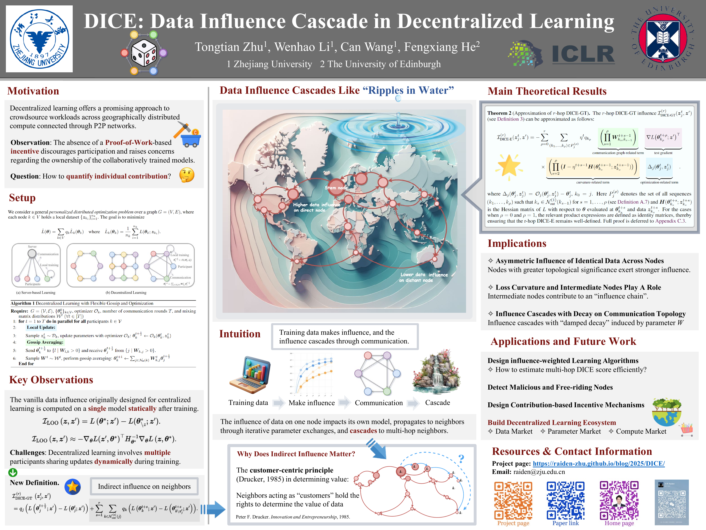

<div align="center">
  
# [ICLR 2025] DICE: Data Influence Cascade in Decentralized Learning

[](LICENSE)
[](https://x.com/Raiden13238619/status/1882111164735512790)
[](https://github.com/Raiden-Zhu/ICLR-2025-DICE/blob/main/Slides_DICE.pdf)
[](https://github.com/Raiden-Zhu/ICLR-2025-DICE/blob/main/Poster_DICE.png)
[-gray)](https://iclr.cc/virtual/2025/poster/31136)
[-gray)](https://www.bilibili.com/video/BV1vwQrY5Et7/?buvid=XUFF680FF7C1ABA2FFD32DD9B756BF18C040C&is_story_h5=false&mid=lVabSomKEmqYwodmqWa%2B0A%3D%3D&plat_id=240&share_from=ugc&share_medium=android&share_plat=android&share_source=WEIXIN&share_tag=s_i&spmid=dt.space-dt.0.0&timestamp=1742098984&unique_k=NGTUExG&up_id=503316308&vd_source=18cb2457b9e9e0bb4339e9c9817a6ec4)


<div style="text-align: center;">
  
</div>

</div>

This repo contains source code for reproducing the main empirical results in DICE paper. The following is a detailed guide on how to install dependencies and run the experiments.

## Table of Contents
- [Installation](#installation)
- [Running Experiments](#running-experiments)
- [Project Structure](#project-structure)
- [Arxiv Link](https://openreview.net/forum?id=2TIYkqieKw)
- [Citation](#Citation)
- [Contact Information](#Contact)

## Installation
### Prerequisites
- Ensure you have Python installed on your system.
- `pip` should be available for package installation.

### Steps
1. Clone the repository to your local machine:
```bash
git clone https://github.com/Raiden-Zhu/ICLR-2025-DICE.git
cd ICLR-2025-DICE
```
2. Install the required dependencies using the `requirements.txt` file:
```bash
pip install -r requirements.txt
```

## Running Experiments
This project contains three sets of experiments, each corresponding to a different directory. You can run the experiments by following these steps:

### Experiment 1 (Influence Alignment)
In this experiment, we calculate the actual and estimated values of the **one-hop** DICE value. The results are written into the corresponding JSON files in the `experiment1/loss_record` folder.
Please navigate to the `experiment1` directory and execute the `run.sh` script:
```bash
cd experiment1
bash run_repeat.sh
```

### Experiment 2 (Anomaly Detection)
In this experiment, we calculate and compare the influence indicators (i.e., gradient dot product derived via one-hop DICE value) of normal nodes and abnormal nodes. The  results are written into the corresponding JSON files in the `experiment2/loss_record` folder.
Similarly, for Experiment 2, please move to the `experiment2` directory and run the `run.sh` script:
```bash
cd ../experiment2
bash run_repeat.sh
```

### Experiment 3 (Influence Cascade)
In this experiment, we calculate **multi-hop** DICE value. The results are written into the corresponding JSON files in the `experiment3/loss_record` folder.
To run Experiment 3, enter the `experiment3` directory and execute the `run.sh` script:
```bash
cd ../experiment3
bash run_repeat.sh
```

## Project Structure
```plaintext
ICLR-2025-DICE/
│
├── experiment1/
    └──loss_record
    └──networks
    └──our_datasets
    └──utils
    └──workers
    └──main_new.py
    └── run_repeat.sh
├── experiment2/
├── experiment3/
├── requirements.txt
└── README.md
```

### Citation

Please consider citing our paper if you find this repo useful in your work 😀.

```
@inproceedings{
zhu2025dice,
title={{DICE}: Data Influence Cascade in Decentralized Learning},
author={Tongtian Zhu and Wenhao Li and Can Wang and Fengxiang He},
booktitle={The Thirteenth International Conference on Learning Representations},
year={2025},
url={https://openreview.net/forum?id=2TIYkqieKw}
}
```

### Contact

If you have any questions, please feel free to open an issue or contact via email at raiden@zju.edu.cn.
